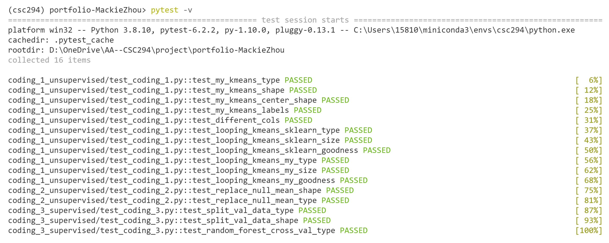

# CSC 294 Final Portfolio - Mackie Zhou

## Me and My Portfolio

I am Mackie Zhou, a sophomore majoring in Computer Science and Statistical and Data Sciences at Smith College. Welcome to my final portfolio for CSC 294 Computational Machine Learning!

The skills and expertise you have in machine learning
The depth of your knowledge in the field
Your interests beyond machine learning 

## Coding Projects

### 1 Unsupervised ML: High Value Customers Identification

**Keywords:**
unsupervised machine learning, clustering, KMeans, elbowology, efficacy comparison

**Self-defined Functions:** `recompute_centers`, `my_kmeans`, `calculate_within_cluster_sse`, `looping_kmeans_sklearn`, `looping_kmeans_my`

This is a revision of hw2.

The dataset used in this project is the [UK-High value Customers Identification](https://www.kaggle.com/vik2012kvs/high-value-customers-identification) dataset. In this coding project, I will use k-means to segment customers into clusters and identify the group of high-value customers--customers who are loyal to the brand or make high purchases--for a UK-based online retail store. In this project, I will use KMeans to segment customers into clusters. I will use elbowology to choose the best number of clusters and will compare efficacy of my own "cold" implementation of KMeans and the KMeans algorithm from sklearn.

### 2 Customer Segmentation on the Credit Card Dataset (Unsupervised)

**Keywords:** unsupervised machine learning, clustering, hierarchical clustering, spectral clustering, KMeans

**Self-defined Functions:** `replace_null_mean`

The dataset used in this project is [Credit Card Dataset for Clustering](https://www.kaggle.com/arjunbhasin2013/ccdata).

Credit card users also have different behaviors. This credit card dataset contains usage behavior of about 9000 active credit card holders in last 6 months1. The task here is to segment credit card users into clusters based on their different behaviors. In this project, I will try different strategies to segment the credit holders and find the model that makes the most sense. I will try hierarchical clustering, spectral clustering, and KMeans.

### 3 Supervised ML: Company Bankruptcy Prediction

**Keywords:**
supervised machine learning, classification, ensemble method, random forest, cross-validation

**Self-defined Functions:** `split_val_data`, `random_forest_cross_val`

The dataset used in this project is the [Company Bankruptcy Prediction](https://www.kaggle.com/fedesoriano/company-bankruptcy-prediction) dataset, which is a Bankruptcy data from the Taiwan Economic Journal for the years 1999–2009. My goal is to train a random forest model to predict whether a business will go bankrupt. I will use PCA to reduce the dimension of the dataset. I will use cross-validation to choose the best hyperparameters for the random forest model and then fit a model with the "best" set of hyperparameters.

### Picture of unit tests passing for all 3 projects

