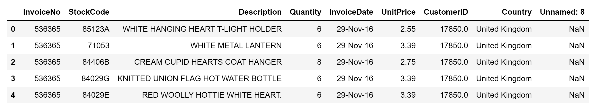

# Supervised ML: High Value Customers Identification

## Introduction

Customer segmentation is a classical clustering problem. Companies want to divide customers into groups that have similar purchase behaviors to better promote their products, increase customer retention, and maximize benefits for the business1.

In this project, I will use the [High-Value Customers Identification](https://www.kaggle.com/vik2012kvs/high-value-customers-identification) dataset from Kaggle. The dataset contains sales data from a UK-based online retail company over the period of November 2016 to December 2017. The goal of the project is segment customers into groups and identify the group of high-value customers--those who are loyal to the brand and really spend money.

This project takes a large portion of code from homework 2, with significant changes included (will be discussed in the following sections). I will use **KMeans** to segment customers into clusters. I will choose the best number of clusters based on **elbowology** and will compare **efficacy** of my own **"cold" implementation of KMeans** and the KMeans algorithm from sklearn.

## The Dataset

The dataset has 541909 entries where each entry contains 9 variables about one specific transaction, and we are going to focus on 4 of them: `CustomerID`, `Quantity`, `UnitPrice`, and `Country`. Below is a preview of the dataset.

In this project, customers are the datapoints that I am interested in clustering. In other words, in the resulting dataset, each entry should include all the information I need for one customer. For each customer, I will sum up these three pieces of information:

1. the total amount of money spent by the customer
2. the total quantity of products bought by the customer
3. the country where the customer is from

In processing the dataset, I will ignore entries where at least one of `Quantity`, `UnitPrice`, and `Country` variables is missing. I will multiple `Quantity` and `UnitPrice` to get the value of a transaction. Then, I will group the dataset by `CustomerID` and sum up the total amount of spending (`Total`) and total quantity (`Quantity`) for each customer. `Country` is a categorical variable, so I will convert the countries into integers. Since this retail business is UK-based, the most commonly appeared country is the United Kingdom, which is not surprising. Some other countries that also appear in the dataset include France, Australia etc. Below is a preview of the resulting dataset.

## Looping KMeans and Efficacy Comparison

## Elbowology: Choosing the Best k

## Conclusion

Work Consulted:

1 [Customer Clustering For Better Customer Engagement](https://www.c-zentrix.com/blog/customer-clustering-for-better-customer-engagement)