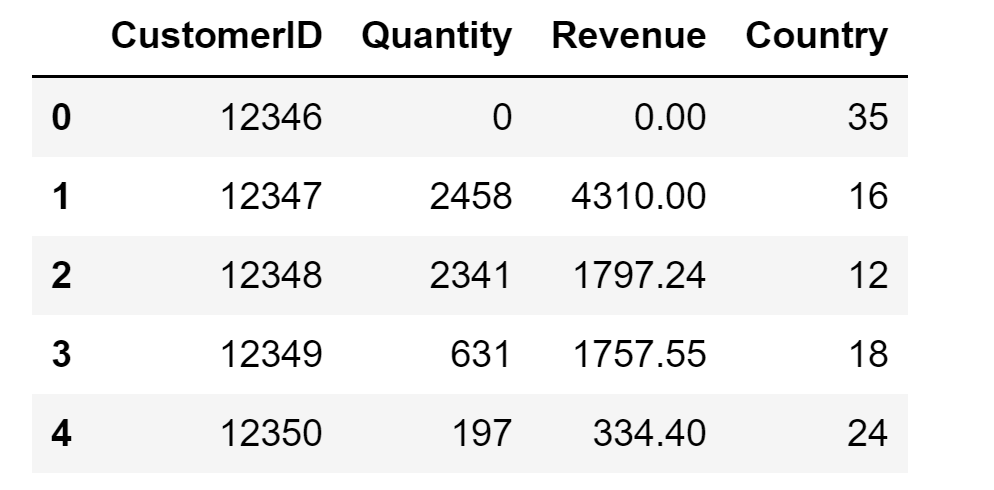

# Unsupervised ML: High Value Customers Identification

Customer segmentation is a classical clustering problem. Companies want to divide customers into groups that have similar purchase behaviors to better promote their products, increase customer retention, and maximize benefits for the business1.

In this project, I will use the [High-Value Customers Identification](https://www.kaggle.com/vik2012kvs/high-value-customers-identification) dataset from Kaggle. The dataset contains sales data from a UK-based online retail company over the period of November 2016 to December 2017. The goal of the project is to separate customers into groups and identify the group of high-value customers--those who are loyal to the brand and really spend money. Since the customers are not labeled and we do not even know what is the correct number of clusters for this dataset, this is an **unsupervised** machine learning task.

This project is a revision of hw2. I will use **KMeans** to segment customers into clusters. I will use **elbowology** to choose the best number of clusters and will compare **efficacy** of my own **"cold" implementation of KMeans** and **the KMeans algorithm from sklearn**.

## 1. The Dataset

The dataset has 541909 rows where each row contains 9 variables about one specific transaction, and I will focus on 4 of them: `CustomerID`, `Quantity`, `UnitPrice`, and `Country`. Below is a preview of the dataset.

I will need to process the dataset so that, in the resulting dataset (the input dataset my model will train on), each row represents a customer. For each customer, I will sum up these three pieces of information:

1. the total amount of money spent by the customer (`Revenue`)
2. the total quantity of products bought by the customer (`Quantity`)
3. the country where the customer is from (`Country`)

In processing the dataset, I will ignore rows where at least one of `Quantity`, `UnitPrice`, and `Country` variables is missing. I will multiple `Quantity` and `UnitPrice` to get the value of a transaction. Then, I will group the dataset by `CustomerID` and sum up the total amount of spending (`Revenue`) and total quantity (`Quantity`) for each customer. I will convert the categorical `Country` variable to numerical, each country having a unique code. Since this retail business is UK-based, the most commonly appeared country is the United Kingdom (35), which is not surprising. Some other countries that also appear in the dataset include France, Australia etc. Below is a preview of the resulting dataset.

## 2. Looping KMeans and Efficacy Comparison

The hyperparameter here is k, the number of clusters. I will use elbowology to find the best k. I also want to compare the efficacy of my KMeans implementation and that of sklearn's KMeans implementation. Therefore, I will implement a looping-KMeans (k=2 to k=15) first with my KMeans and then with sklearn's KMeans and compare the runtime and memory usage.

**Time:**

* sklearn's KMeans took 8.021277904510498 seconds to run
* my KMeans took 50.782066106796265 seconds to run

It took significantly longer time to run my KMeans, which is surprising to me. In lab 18, I have timed my KMeans and sklearn's KMeans on the student_info dataset, and my KMeans took slightly shorter time than sklearn's KMeans did. I guess one reason to explain the opposite results I got is the size of the dataset. The dataset used in this project is significantly larger then the student_info dataset, which may have magnified the inefficient sections in my implementation.

**Memory:**

* sklearn's KMeans - peak memory: 229.73 MiB, increment: 0.03 MiB
* my KMeans - peak memory: 230.39 MiB, increment: 0.65 MiB

Though the peak memory usage of my KMeans and sklearn's KMeans are about the same, increment of my implementation is significantly larger than that of sklearn's. As stated in [this post](https://stackoverflow.com/questions/45318536/trying-to-understand-python-memory-profiler)2, "Increment is the increment in memory usage relative to the memory usage just before the program is run." Since my implementation has a larger increment in memory usage, again, my implementation is significantly less efficient than that of sklearn's.

## 3. Elbowology: Choosing the Best k

I have implemented looping KMeans with my KMeans and sklearn's KMeans and got two lists of within-cluster SSE. I plot the within-cluster SSE over the number of clusters and got the plot below.

The "elbow" is not that obvious in the plot above. However, there seems to be a slight "elbow" at k=4 for both lines. Therefore, I decide the best number of clusters is 4.

## 4. Modeling and Interpretation

I plot `Quantity` over label, `Revenue` over label, and `Country` over label and got the plots below.

Since there are few points in class 2 and 3 and that those points have uncommonly high `Quantity` and `Revenue`, my guess is that those are outliers. Looking at group 1 and group 4, my observations are:

* in general, data points in group 4 have higher `Quantity` than those in group 1
* in general, data points in group 4 have higher `Revenue` than those in group 1
* in general, customers in group 4 are from the UK (country code 35)

My conclusion is that customers in group 4 are the high-value customers we are finding, since they have bought more products and spent more money. It is more likely that high-value customers are from the UK, which makes sense since the base of the business is in the UK.

## Work Consulted:

1 [Customer Clustering For Better Customer Engagement](https://www.c-zentrix.com/blog/customer-clustering-for-better-customer-engagement)

2 [Understand python memory profiler on Stackoverflow](https://stackoverflow.com/questions/45318536/trying-to-understand-python-memory-profiler)