# Unsupervised ML: Credit Card User Segmentation

Credit card users also have different behaviors. This [credit card dataset](https://www.kaggle.com/arjunbhasin2013/ccdata) contains usage behavior of about 9000 active credit card holders in last 6 months1. The task here is to segment credit card users into clusters based on their different behaviors.

In this project, I will try different strategies to segment the credit holders and find the model that makes the most sense. I will try hierarchical clustering, spectral clustering, and KMeans.

## 1. The Dataset

The Dataset has 8950 rows and 18 columns. The first column is the ID number of the card holder, and the rest of the columns are numerical, behavioral variables of card holders. Below is a preview of the datset and the first couple of variables.

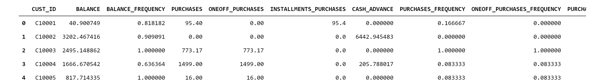

There are null values in the dataset, so I will replace all null values with the mean of the corresponding variable. After that, I will normalize all 17 numerical variables.

## 2. Dimension Reduction with PCA and Visualization

The dataset has 17 numerival values, which makes it impossible to visualize. Therefore, I will use PCA to reduce the dimension of the dataset and plot a 2D and a 3D visualization of the dataset to better understand the dataset.

**2D and 3D Visualization after PCA Dimension Reduction**

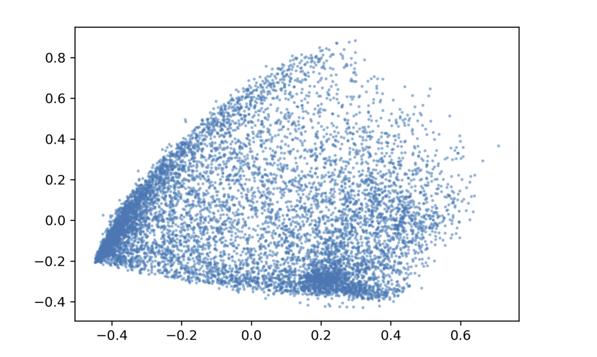
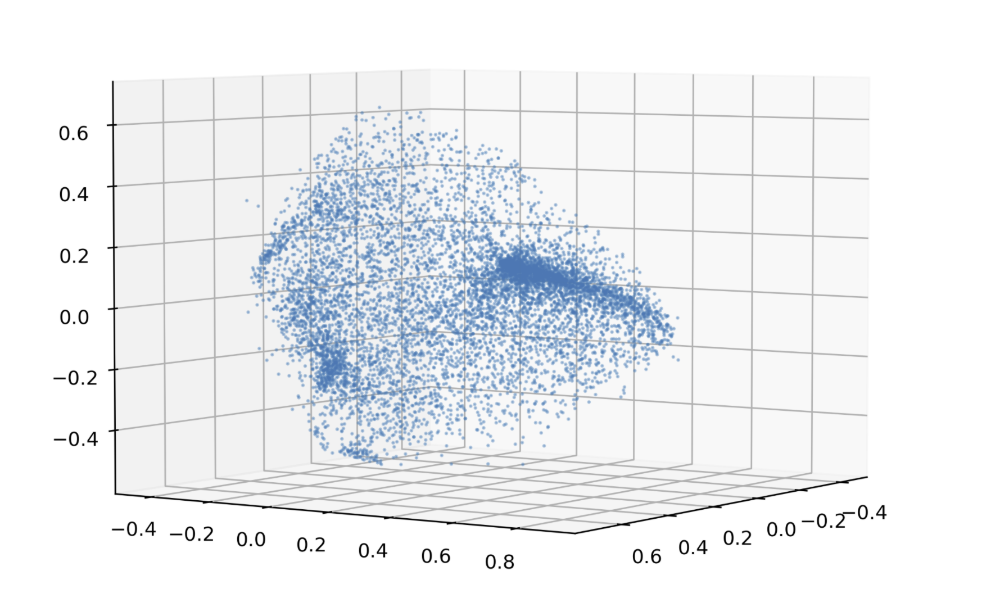

Still, it is hard to tell the exact number of clusters in the dataset. In both visualizations, I think there are at least 2 groups of points that are densely placed. Therefore, in the following sections, I will try different modeling methods with 2, 3, and 4 clusters.

## 3. Hierarchical clustering

Hierarchical clustering recursively merges similar clusters. It is useful in comparing similarities between data points. Here, I will use hierarchical clustering (`sklearn.cluster.AgglomerativeClustering`) to segment credit card users who have similar behaviors into clusters.

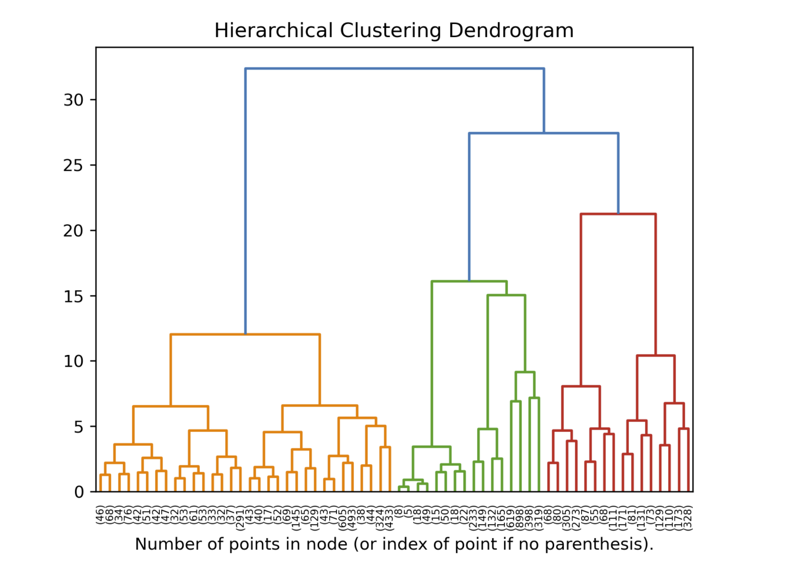

I compute the whole tree and plot the top 5 layers of the tree and got the dendrogram above. It is very clear that there are three main branches of different colors. Therefore, I will fit a hierarchical clustering model of 3 clusters.

**3 clusters:**
The visualization below is colored according to the labels predicted by the hierarchical clustering model of 3 clusters. In the 2D plot, three clusters are not clearly separated, but blend into each other

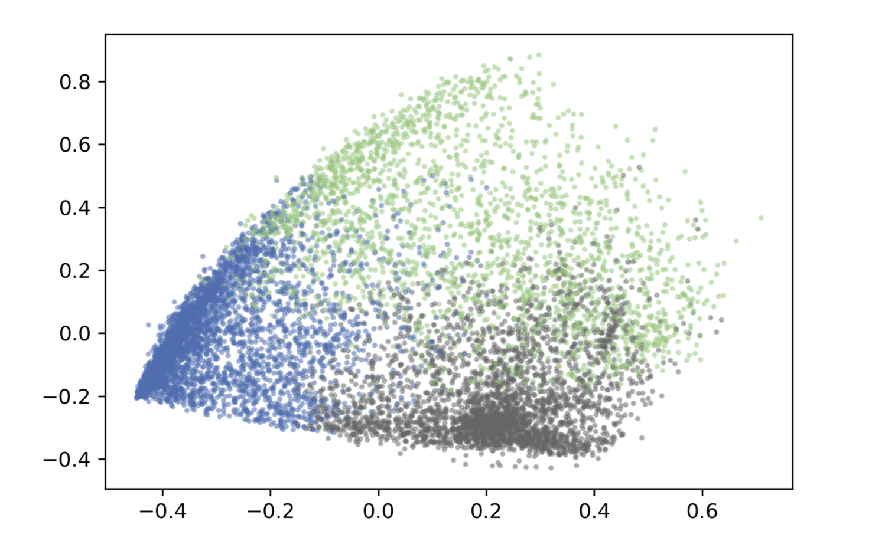

**4 clusters:**
Visualizations below are colored according to the labels predicted by the hierarchical clustering model of 4 clusters. In the 2D plot, It seems like pink, green, and orange color each occupies a cluster and the black cluster blends into the other three. However, if you turn the 3D plot to a specific perspective, you will see that the black cluster is a separate cluster and occupies its own space.

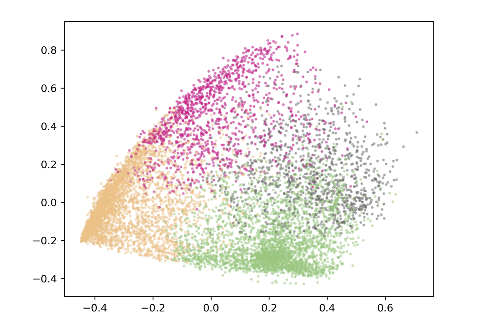
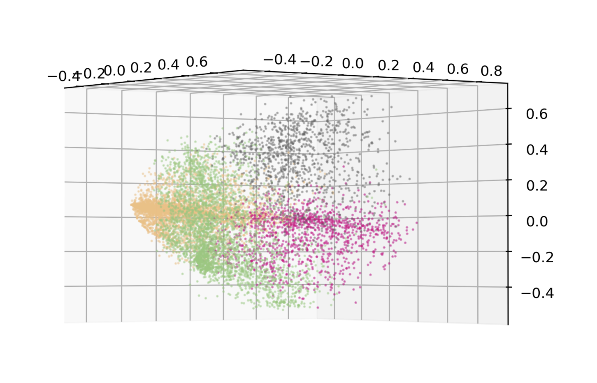

## 4. Spectral Clustering

Next, I will try to use spectral clustering (`sklearn.cluster.SpectralClustering`) to segment credit card holders in the dataset.

**2 clusters and 3 clusters:**
Visualizations below are colored according to the labels predicted by the spectral clustering model of 2 and 3 clusters, respectively. In both plots, data points are separated into distinct groups without blending into each other. From my own perspective, in the plot with 2 clusters, the "border line" of the two clusters should be more inclined to the right. Therefore, I think spectral clustering with 2 clusters is clearly not the "correct" model for this dataset.

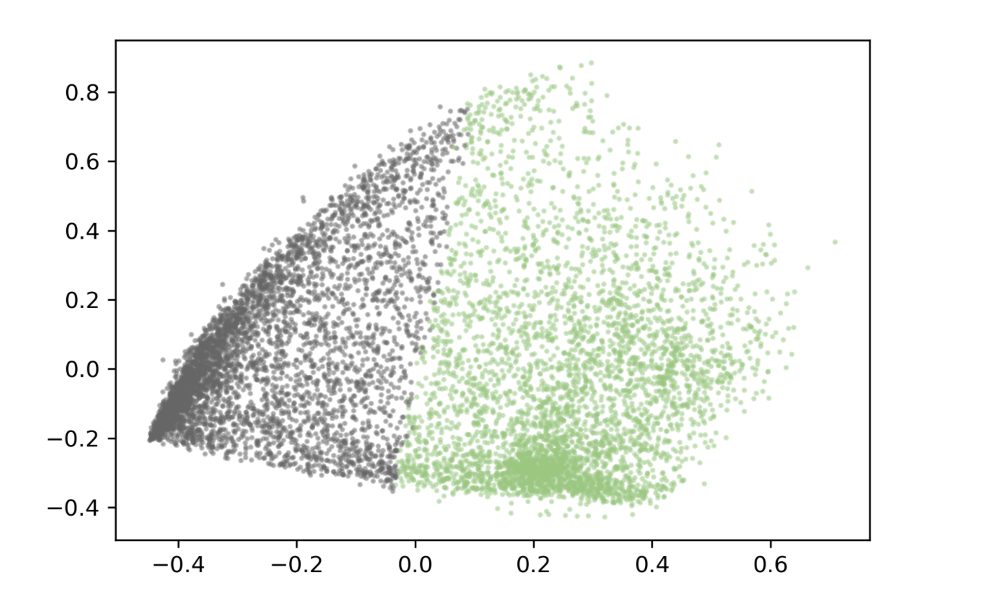
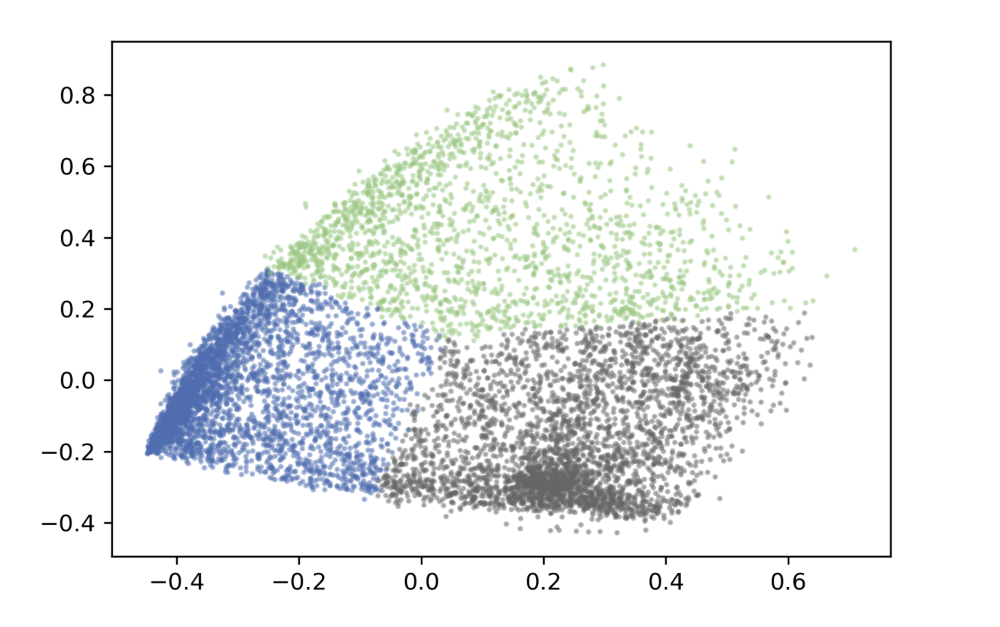

**4 clusters:**
Visualizations below are colored according to the labels predicted by the hierarchical clustering model of 4 clusters. In the 2D plot, the orange cluster and the black cluster almost overlap. However, again, if you turn the 3D plot to a specific perspective, you will see that the black cluster and the pink cluster do not blend into each other.

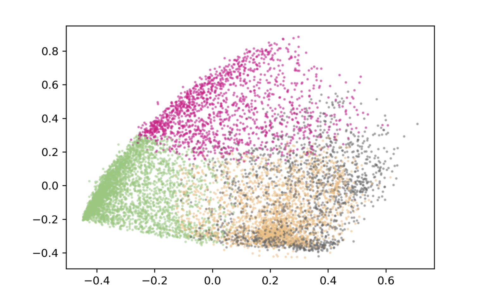
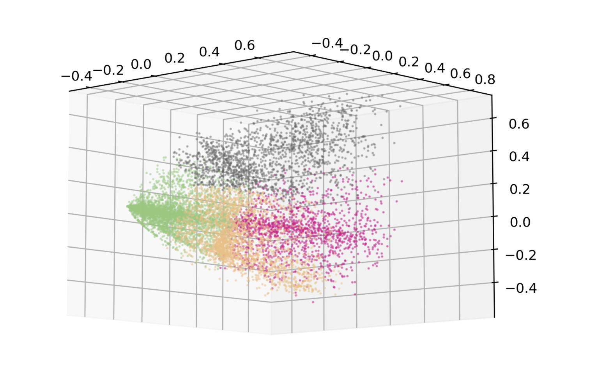

## 5. KMeans

Lastly, I will try to use KMeans (`sklearn.cluster.KMeans`) to group data points into segments.

**2 clusters and 3 clusters:**
Visualizations below are colored according to the labels predicted by KMeans model of 2 and 3 clusters, respectively. As in spectral clustering, when n=2 or n=3, data points are separated into distinct groups without blending into each other in 2D plots. When n=2, the border line looks more correct than that got from spectral clustering.

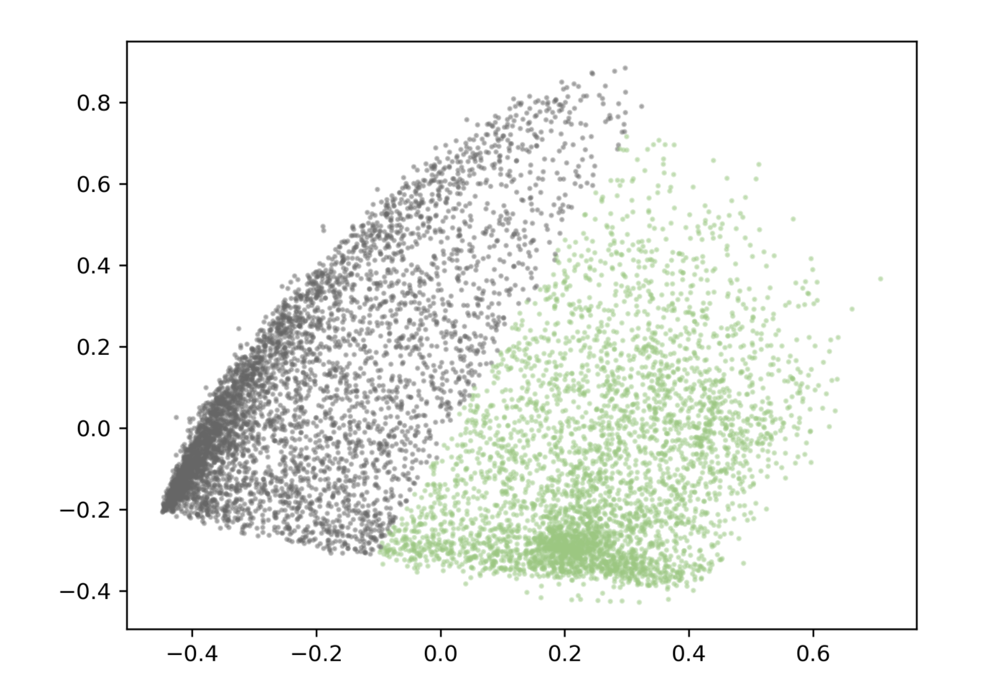
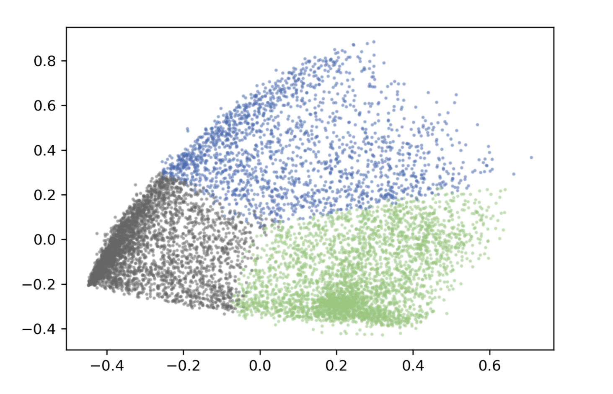

**4 clusters:**
Visualizations below are colored according to the labels predicted by KMeans model of 4 clusters. The situation here is very similar to that got from spectral clustering. Though the pink cluster and the orange cluster overlap in the 2D plot, they are actually separated in the 3D plot.

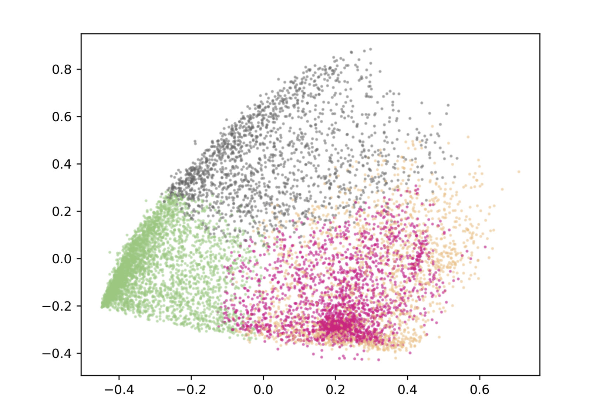
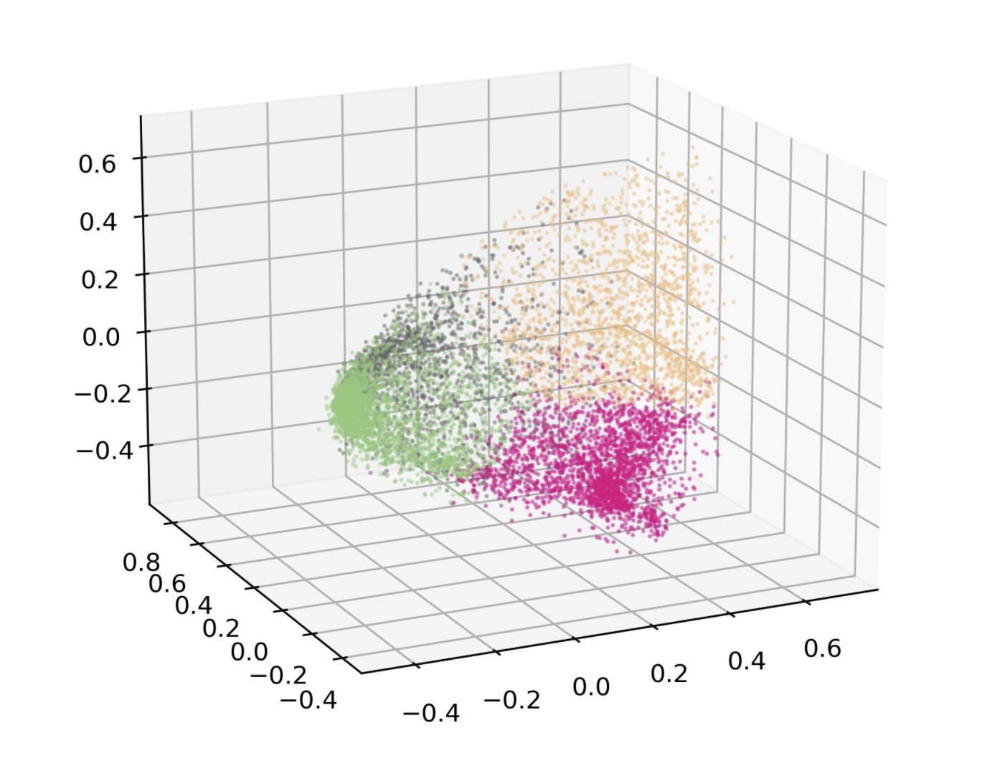

## 6. Analysis and Conclusion

From my own perspective, hierarchical clustering does not do the best job in segmenting this dataset, since in both the 2D and the 3D visualizations, clusters are not clearly separated.

In the case of 2 clusters, as explained in the previous section, I think KMeans does a better job than spectral clustering does, since the border line got by KMeans makes more sence to me than that got by spectral clustering in 2D visualizations. In the case of 3 or 4 clusters, I think both spectral clustering and KMeans do an equally good job, and their segmentations are very close in 2D visualizations.

It is difficult to choose the best segmentation. From my own perspective, KMeans with n_clusters=2 gives the best segmentation for this dataset.

## Work Consulted:  
1 [Credit Card Dataset for Clustering](https://www.kaggle.com/arjunbhasin2013/ccdata) on Kaggle