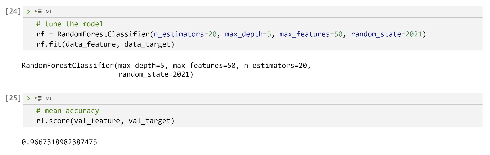

# Supervised ML: Company Bankruptcy Prediction

In this project, I will complete a classification task. The dataset I will look at is [the Company Bankruptcy Prediction dataset from Kaggle](https://www.kaggle.com/fedesoriano/company-bankruptcy-prediction), which is a Bankruptcy data from the Taiwan Economic Journal for the years 1999–2009.

My goal is to train a **random forest** model to predict whether a business will go bankrupt. I will use **PCA** to reduce the dimension of the dataset. I will use **cross-validation** to choose the best hyperparameters for the random forest model and then fit a model with the "best" set of hyperparameters.

## 1. The Dataset

The dataset has 6819 rows and 96 columns. Each row represents a company. The first column `Bankrupt?` is the target I want to predict, and I will use the other 95 numerical features to train the mode. First I will need to standardize the numerical variables. Below is a preview of the full dataset and the first couple of variables

I will split the dataset into two sets: the train/test dataset and the validation dataset. I will use cross-validation and fit models on the train/test dataset to decide the set of hyperparameters I should use, fit a model with the best set of hyperparameters on the train/test dataset, and test the model on the validation dataset. The validation dataset contains 15% of all data points.

## 2. Dimension Reduction with PCA

The data has 6819 rows. Except for the first column `Bankrupt?` (boolean), there are 95 numerical features that I can use to predict `Bankrupt?`. 95 features are a lot and may slow down the calculation significantly. Therefore, I will first use PCA to reduce the dimension of this dataset.

I will also split the dataset after dimension reduction into validation and train/test sets for later us when fitting models

## 3. Random Forest & Cross-Validation

Before fitting a model, I will need to decide:

* should I fit a model on the dataset before or after dimension reduction
* what hyperparameters I should use when fitting a model

In this section, I will implement 10-fold cross-validation on random forest models with different hyperparameters and input datasets. I will decide on the hyperparameters as well as input datasets.

## 4. Tune the Best Model

Each time I run the codes, I get slightly different cross-val errors, but all cross-val errors are always very close and very small. In the last run, the smallest cross-validated error got in section 3 is 0.0300. The input dataset/hyperparameters are

* input dataset: without dimension reduction  
* n_estimators: 20  
* max_depth: 5  
* max_features: 50

I fit the model on the train/test dataset before dimension reduction and test the model on the validation dataset. The mean accuracy is 0.9667.

